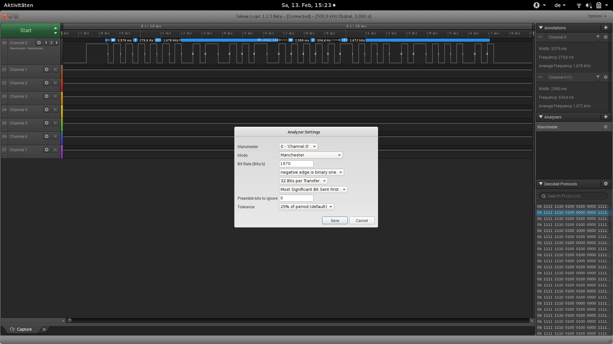

This project is heavily inspired by the previous research and ideas of [Ian Renton](https://ianrenton.com/) and his [Raspberry Tank](https://ianrenton.com/hardware/raspberry-tank/) project. I just realized, the codes detected by Ian does not correspond to my measurements and I also would like to have proper codes for all speeds provided by the electronics. So I decided to do my own reverse engineering research using the logic probe from [__Saleae__](https://www.saleae.com/index) and some python coding to apply some basic statistics (and improve my skills with python pandas and data visualization).
All credits for the original idea and data goes to Ian Renton and other people involved in his research.

# Data acquisition

## Preparations

+ put some batteries in the remote
+ connect the receiver to some power supply
 + green wire - power 7,2V
 + red - GND
 + black - signal

### Install the Salae logic drivers
+ download the software https://www.saleae.com/downloads
+ cd ... /Logic 1.2.5 (64-bit)/Drivers
+ sudo ./install_driver.sh
+ sudo udevadm control --reload-rules

## Caputure

### Caputure settings

+ Speed (Sample rate) 250 kHz
+ duration 5sec
+ Add analyzer(s)
 + Manchester
 + Bit Rate (Bits/s) : 1500 / 1670 ???
 + negative edge is binary one
 + 32 Bits per Transfer
 + Most Significant Bit Sent First

  

# Analysis

## Preparations

I use _python pandas_ for the analysis of the captures and _matplotlib_ for

### Installation

```bash
# On Fedora
sudo dnf install python-pandas python-matplotlib
# On Ubuntu
sudo apt-get install pyhton-pandas python-matplotlib
```
